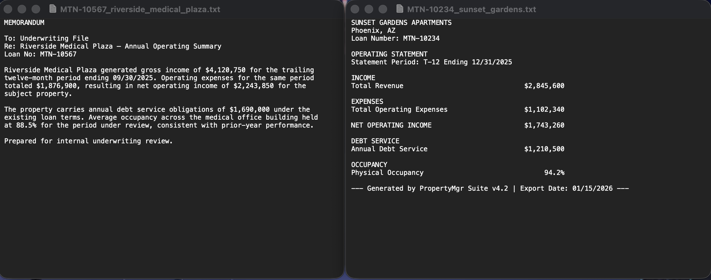
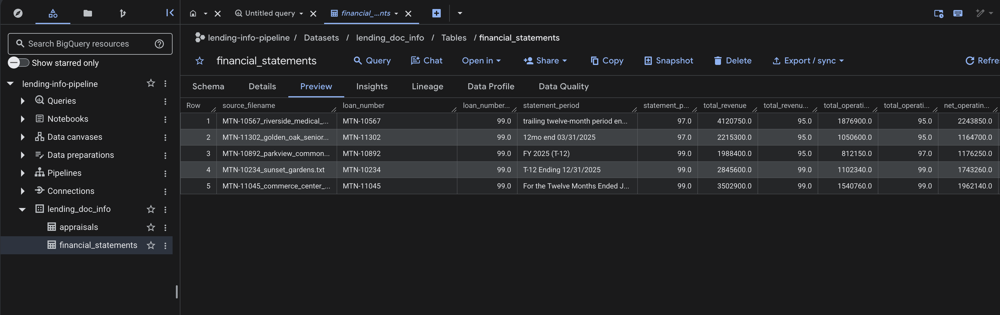

# Commercial Real Estate Lending Information Assistant

A full-stack application that uses LLMs to answer natural-language questions about commercial real estate loans. Instead of traditional RAG, this system extracts structured data from loan documents into BigQuery, then injects that data as context for the LLM - avoiding hallucinations on numbers while enabling precise, grounded answers.

**Stack:** React + FastAPI + BigQuery + Anthropic Claude

---

## The Problem

Underwriting teams need to query loan information across multiple documents (financial statements, appraisals, etc.). Writing SQL queries is slow and requires technical expertise. Natural language interfaces with traditional RAG risk hallucinating numbers. This system provides natural language access to structured loan data with confidence scores for each extracted field.

---

## The Data

The project includes sample loan documents for 5 commercial properties:

**Loan Numbers:** MTN-10234, MTN-10567, MTN-10892, MTN-11045, MTN-11302

**Document Types:**
- **Financial Statements** (`financial_statement_files/`) - T-12 operating statements with revenue, expenses, NOI, debt service, occupancy rates
- **Appraisals** (`appraisal_files/`) - Property valuations with appraised value, cap rates, NOI estimates, square footage

**Note:** These are AI-generated sample documents for demonstration purposes. They follow realistic formats but are not real loan data.

---

## Part 1: Building the BigQuery Tables (Extraction Pipeline)

### The Approach: Structured Grounding Over RAG

Rather than using traditional RAG (where the LLM searches through document embeddings), this system:

1. **Extracts structured data** from unstructured documents using Claude
2. **Stores in BigQuery** with confidence scores for each field
3. **Injects structured data** as context when answering questions

**Why this approach?**
- **Avoids hallucinations** - Numbers come directly from structured data, not LLM generation
- **Easier debugging** - Can inspect extracted data in BigQuery before answering questions
- **Faster queries** - No embedding search or chunking; direct SQL lookup by loan number
- **Confidence tracking** - Each extracted field has a confidence score (0-100)

LLM-based extraction handles varied document formatting that would break rigid parsers. The sample financial statements demonstrate this - each property uses different layouts, section headers, and value formatting:



### The Extraction Workflow: `to_bq_pipeline.ipynb`

This notebook runs the document-to-BigQuery extraction pipeline. **It was designed for GCP environments** (specifically Vertex AI Workbench) but can be adapted for local use.

**Flow:**
```
Unstructured Documents (TXT files)
    ↓
Claude LLM Extraction (Sonnet 4)
    ↓
Structured JSON (field + confidence)
    ↓
Pandas DataFrame
    ↓
BigQuery Tables
```

**Key Steps:**

1. **Document Reading** - Reads TXT files from Cloud Storage buckets
2. **LLM Extraction** - Sends document text to Claude with structured prompt defining required fields
3. **Confidence Scoring** - Claude returns each field value with a confidence score (0-100)
4. **DataFrame Assembly** - Flattens JSON into rows with columns: `field_name`, `field_name_confidence`
5. **BigQuery Load** - Uploads DataFrame to BQ table with schema validation

**Example Extracted Row:**
```python
{
  "source_filename": "MTN-10234_sunset_gardens.txt",
  "loan_number": "MTN-10234",
  "loan_number_confidence": 99.0,
  "statement_period": "T-12 Ending 12/31/2025",
  "statement_period_confidence": 95.0,
  "total_revenue": 2845600.0,
  "total_revenue_confidence": 95.0,
  "net_operating_income": 1743260.0,
  "net_operating_income_confidence": 99.0,
  ...
}
```

### Configuration: `pipeline_helpers.py`

Shared configuration used by both extraction and Q&A workflows:

```python
BQ_DS = "lending_doc_info"  # BigQuery dataset name

# Maps Cloud Storage buckets to BigQuery table names
gcs_bq_map = {
    "loan-pipeline-demo-financial-statements-bucket": "financial_statements",
    "loan-pipeline-demo-appraisals-bucket": "appraisals"
}

# Defines schema for each document type
req_fields_map = {
    "loan-pipeline-demo-financial-statements-bucket": [
        ("loan_number", "STRING"),
        ("statement_period", "STRING"),
        ("total_revenue", "FLOAT"),
        ("net_operating_income", "FLOAT"),
        # ...
    ],
    "loan-pipeline-demo-appraisals-bucket": [
        ("loan_number", "STRING"),
        ("appraised_value", "FLOAT"),
        ("capitalization_rate", "FLOAT"),
        # ...
    ]
}
```

This centralized config ensures extraction and Q&A stay in sync on table/field names.

### BigQuery Result

Two tables in the `lending_doc_info` dataset:
- **financial_statements** - 5 rows (one per loan)
- **appraisals** - 5 rows (one per loan)

Each table has: `source_filename`, `loan_number`, then field-specific columns with corresponding `_confidence` columns.



---

## Part 2: Testing the Q&A Logic (Spot-Check Notebook)

### `llm_interaction.ipynb`

Before building a full application, this notebook validates that the LLM-BQ pipeline works end-to-end. **Also designed for GCP environments** (Workbench).

**The Three-Step Q&A Flow:**

```python
def answer_question(user_question: str, table_ids: list[str]) -> str:
    # Step 1: Extract loan number from question (LLM)
    loan_number = extract_loan_number(user_question)
    
    # Step 2: Pull structured records from BigQuery
    loan_data = pull_loan_records(loan_number, table_ids)
    
    # Step 3: Generate grounded answer (LLM with data as context)
    return generate_grounded_answer(user_question, loan_data)
```

**Function Details:**

**1. `extract_loan_number(user_question: str) → str | None`**
- Uses Claude to extract loan number from natural language
- Returns `"MTN-10234"` or `None` if no loan number found
- This is a simpler alternative to semantic search - user must mention the loan

**2. `pull_loan_records(loan_number: str, table_ids: list[str]) → dict | None`**
- Queries BigQuery for the loan number across multiple tables
- Merges results into single JSON structure
- Example return:
```json
{
  "loan_number": "MTN-10234",
  "financial_statements": {
    "source_filename": "MTN-10234_sunset_gardens.txt",
    "fields": {
      "net_operating_income": {"value": 1743260.0, "confidence": 99.0},
      "total_revenue": {"value": 2845600.0, "confidence": 95.0}
    }
  },
  "appraisals": {
    "source_filename": "MTN-10234_sunset_gardens_appraisal.txt",
    "fields": {
      "appraised_value": {"value": 29200000.0, "confidence": 99.0}
    }
  }
}
```

**3. `generate_grounded_answer(user_question: str, loan_context: dict) → str`**
- Injects structured data as context in prompt to Claude
- LLM generates answer strictly from provided data
- If confidence < 90, flags value for manual verification
- Example prompt structure:
```
System: You help answer questions about loans. Always answer using ONLY 
        the values in the context. Mention confidence scores.

User: What was the NOI for loan MTN-10234?

      Context:
      {
        "net_operating_income": {"value": 1743260.0, "confidence": 99.0}
      }
```

**Spot-Check Testing:**

The notebook tests several questions:
```python
"What was the net operating income for loan number MTN-10234?"
"What was estimated value and cap rate for loan number MTN-10234?"
"Tell me about loan number MTN-10234, cite sources."
```

Validates that:
- Loan numbers are correctly extracted
- BigQuery data is correctly retrieved
- Answers are grounded in actual data with confidence scores cited

---

## Part 3: The Product (Local Development)

### Architecture

```
User enters question
    ↓
React Frontend (localhost:5173)
    ↓ [POST /ask with {"question": "..."}]
FastAPI Backend (localhost:8000)
    ↓
1. Extract loan number (Claude)
2. Query BigQuery
3. Generate answer (Claude with BQ data)
    ↓ [Returns {"answer": "..."}]
Frontend displays answer
```

### Frontend: User Experience

**File:** `frontend/src/App.jsx` + `frontend/src/App.css`

The UI is a professional chat interface designed for lending/underwriting teams:

**Design Decisions:**
- **Navy blue color scheme** (#1e3a5f) - Professional, trustworthy, finance-appropriate
- **No playful aesthetics** - No gradients, bubbles, or consumer chat styling
- **Clear visual distinction** - Questions in light blue boxes, answers in white with green border
- **Loading states** - Animated dots with "Processing query and retrieving loan data..." text
- **Professional labels** - "QUESTION" and "ANALYSIS" headers (uppercase, small)

**User Flow:**
1. User types: *"What was the net operating income for loan number MTN-10234?"*
2. Clicks Submit or presses Enter
3. Question immediately appears in chat area (optimistic UI)
4. Loading indicator shows (6-10 seconds typical)
5. Answer appears with:
   - Loan number and property name
   - Requested data point with value
   - Confidence score
   - Manual verification flag if confidence < 90
   - Optional: Cross-reference with other document types (e.g., appraiser's estimate vs financial statement)

**Example Answer:**
```
The net operating income (NOI) for loan number MTN-10234 (Sunset Gardens) 
was $1,743,260.00 for the T-12 period ending 12/31/2025.

This value has a confidence score of 99.0, so you can rely on it with high confidence.

For additional context, the appraiser's independent NOI estimate was $1,752,000.00 
(also at 99.0 confidence), which is closely aligned with the financial statement 
figure — a good sign of consistency between the two sources.
```

<!-- TODO: Add screen recording video here (lending_pipeline_in_action) using GitHub's native video upload -->

**Error Handling:**
- Missing loan number: *"I couldn't find a loan number in your question. Could you include the loan number you're asking about?"*
- Invalid loan number: *"I don't have any records for loan number MTN-54321."*
- Backend unreachable: *"Unable to reach backend service. Please ensure the API server is running at http://localhost:8000."*

### Frontend → Backend Communication

**Frontend Code (simplified):**
```javascript
const handleSubmit = async (e) => {
  e.preventDefault();
  const question = input.trim();
  
  // Add question to UI immediately
  setMessages(prev => [...prev, { type: 'question', text: question }]);
  setIsLoading(true);
  
  // POST to backend
  const response = await fetch('http://localhost:8000/ask', {
    method: 'POST',
    headers: { 'Content-Type': 'application/json' },
    body: JSON.stringify({ question })
  });
  
  const data = await response.json();
  
  // Add answer to UI
  setMessages(prev => [...prev, { type: 'answer', text: data.answer }]);
  setIsLoading(false);
};
```

**CORS:** The backend includes CORS middleware to allow the React frontend (different port) to communicate. Without CORS, browsers block cross-origin requests by default. The middleware adds headers telling the browser it's safe:

```python
app.add_middleware(
    CORSMiddleware,
    allow_origins=["http://localhost:5173"],  # Frontend origin
    allow_credentials=True,
    allow_methods=["*"],
    allow_headers=["*"],
)
```

### Backend: Request Processing

**File:** `backend/main.py`

**API Contract (Pydantic Models):**
```python
class QuestionRequest(BaseModel):
    question: str

class AnswerResponse(BaseModel):
    answer: str
```

Pydantic provides:
- Automatic validation (rejects malformed JSON with 422 error)
- Type safety (catches errors at API boundary)
- Auto-generated API docs at http://localhost:8000/docs

**The `/ask` Endpoint:**
```python
@app.post("/ask", response_model=AnswerResponse)
def ask_question(request: QuestionRequest):
    answer = answer_question(request.question, table_ids)
    return AnswerResponse(answer=answer)
```

**Request Flow:**
1. FastAPI receives POST to `/ask`
2. Validates request body against `QuestionRequest` model
3. Calls `answer_question()` with the validated question string
4. The three-step Q&A flow runs (extract → query → generate)
5. Result wrapped in `AnswerResponse` model
6. FastAPI serializes to JSON: `{"answer": "..."}`
7. Frontend receives and displays

**Environment Setup:**
- `ANTHROPIC_API_KEY` loaded from `.env` via `python-dotenv`
- GCP authentication via Application Default Credentials (no service account keys in code)
- Project ID and table IDs imported from `pipeline_helpers.py`

**Response Time:**
- Step 1 (extract loan number): ~1-2 seconds (LLM call)
- Step 2 (query BigQuery): ~500ms (SQL lookup)
- Step 3 (generate answer): ~5-8 seconds (LLM call with context)
- **Total: 6-10 seconds typical** (loading indicator ensures user knows processing is happening)

### Backend → Frontend Response

The backend returns:
```json
{
  "answer": "The net operating income (NOI) for loan number MTN-10234..."
}
```

Frontend:
1. Parses JSON: `data.answer`
2. Updates React state with new message
3. React re-renders UI
4. Answer appears in white box with green border below the question
5. Loading indicator removed

---

## Setup & Installation

### Prerequisites

- Python 3.11+
- Node.js 16+
- GCP Project with BigQuery (tables already populated)
- Anthropic API key
- GCP Application Default Credentials configured

### Environment Setup

```bash
# Clone repository
git clone <your-repo-url>
cd lending_info_pipeline

# Create .env file
cp .env.example .env
# Edit .env and add your ANTHROPIC_API_KEY
```

### GCP Authentication

```bash
gcloud auth application-default login
gcloud config set project <your-gcp-project-id>
gcloud auth application-default set-quota-project <your-gcp-project-id>
```

### Backend Setup

```bash
cd backend
pip install -r requirements.txt
uvicorn main:app --reload --port 8000
```

Backend runs at http://localhost:8000

### Frontend Setup

```bash
cd frontend
npm install
npm run dev
```

Frontend runs at http://localhost:5173

---

## Testing & Verification

### Automated Integration Tests

**File:** `frontend/test-integration.js`

Tests the full stack end-to-end:

```bash
cd frontend
node test-integration.js
```

**Test Cases:**
1. **Real loan query** - Asks about MTN-10234, verifies actual data returned
2. **Missing loan number** - Asks generic question, verifies error message

**Verified Output:** See `ACTUAL_TEST_RESULTS.md` for actual test runs with response times and full answer text.

### Manual Testing

1. Open http://localhost:5173
2. Submit: *"What was the net operating income for loan number MTN-10234?"*
3. Verify:
   - Question appears immediately
   - Loading dots visible for 6-10 seconds
   - Answer contains: $1,743,260.00, confidence 99.0
4. Submit: *"What is the typical cap rate?"*
5. Verify: Error message about missing loan number

**Results:**
- ✅ Real loan queries return grounded answers with confidence scores
- ✅ Loading state clearly visible (not instant/frozen)
- ✅ Missing loan numbers handled gracefully
- ✅ No crashes or raw error dumps

---

## Key Technical Decisions

### 1. Structured Grounding vs RAG

**Traditional RAG:**
- Embed documents → Store in vector DB → Search by similarity → Pass chunks to LLM
- **Risk:** LLM hallucinates numbers or misinterprets chunked context

**This Approach:**
- Extract to structured data → Store in SQL → Lookup by ID → Inject structured data as context
- **Benefit:** Numbers come directly from database, not LLM generation
- **Benefit:** Can verify extracted data before answering questions
- **Tradeoff:** Requires explicit loan numbers in questions (no semantic search)

### 2. Separate Extraction and Q&A Workflows

**Why not real-time extraction?**
- **Easier debugging** - Can inspect BigQuery data independently
- **Faster queries** - No document parsing during user questions
- **Better error handling** - Extraction failures don't affect Q&A availability
- **Batch processing** - Can extract all documents once, query many times

### 3. Confidence Scoring

Every extracted field has a confidence score (0-100):
- Shows in answers: *"This value has a confidence score of 99.0"*
- Flags low-confidence: *"This value should be manually verified (confidence: 85.0)"*
- Helps underwriters know when to double-check source documents

**Note:** These are the model's self-reported confidence values, not calibrated against ground-truth extraction accuracy. They provide a directional signal (and did track document formatting quality in testing) but should not be treated as validated probabilities.

### 4. GCP Notebooks for Extraction

The `to_bq_pipeline.ipynb` and `llm_interaction.ipynb` notebooks were designed for Vertex AI Workbench:
- Direct access to Cloud Storage buckets
- BigQuery client uses Workbench's default credentials
- Easy iteration and debugging in hosted environment

For local extraction, you'd need to:
- Update bucket paths to local file paths
- Ensure GCP credentials are configured
- Or adapt to read from local file system

---

## Known Limitations

- **Explicit loan numbers required** - No semantic search ("show me all loans in California")
- **GCP notebook dependencies** - Extraction notebooks assume Workbench environment
- **No conversation history** - Each question is independent
- **English only** - No multilingual support
- **Local development only** - Not production-hardened (no auth, rate limiting, etc.)

---

## Stack Deviations & Tradeoffs

Two deliberate architecture choices reflect prioritization decisions under a tight timeline:

**BigQuery over Snowflake:** I chose BigQuery instead of the Snowflake instance listed in the JD. The job description explicitly states that an ~80% stack match is sufficient, and under the time constraint, demo reliability mattered more than exact stack alignment. Migrating to Snowflake is a straightforward next step once I have access to your infrastructure - the SQL queries and data model are database-agnostic.

**Anthropic API over AWS Bedrock:** I used Anthropic's API directly rather than invoking Claude through AWS Bedrock (also listed in the JD). This let me iterate faster during development without setting up AWS credentials and Bedrock permissions. The next step is swapping in Bedrock's `invoke_model` via boto3 - the extraction and grounding logic wouldn't need to change, just the client call.

---

## Future Enhancements

- **Semantic search** - Query across all loans without knowing loan number
- **Conversation memory** - Multi-turn conversations with context
- **Document upload** - Allow users to upload new documents for extraction
- **Audit trail** - Track who asked what questions and when
- **Export results** - Download answers as PDF/Excel reports
- **Comparison queries** - "Compare NOI across all loans in my portfolio"

---

## Tech Stack Summary

- **Frontend:** React 18 + Vite, vanilla CSS
- **Backend:** FastAPI + Pydantic, uvicorn
- **LLM:** Anthropic Claude Sonnet 4
- **Database:** Google Cloud BigQuery
- **Auth:** GCP Application Default Credentials
- **Notebooks:** Jupyter (Vertex AI Workbench)
- **Testing:** Node.js integration tests

---

## Security Notes

⚠️ **Important:** Never commit `.env` file to git
- API keys stored in `.env` (not tracked)
- GCP auth uses Application Default Credentials (no keys in repo)
- CORS restricted to localhost:5173 (update for production)

---

## License

## License

MIT — see [LICENSE](LICENSE) for details.

---
